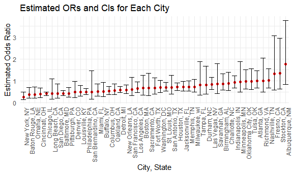
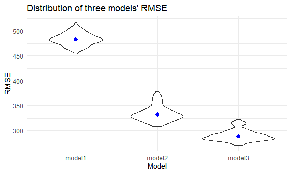
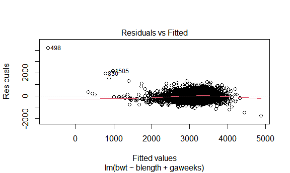
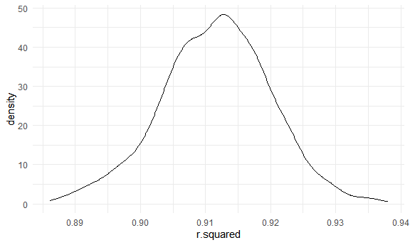

p8105_hw6_qz2266
================
Qing Zhou
2022-11-30

``` r
library(tidyverse)
```

    ## Warning: package 'tidyverse' was built under R version 4.2.2

    ## ── Attaching packages ─────────────────────────────────────── tidyverse 1.3.2 ──
    ## ✔ ggplot2 3.3.6      ✔ purrr   0.3.4 
    ## ✔ tibble  3.1.8      ✔ dplyr   1.0.10
    ## ✔ tidyr   1.2.0      ✔ stringr 1.4.1 
    ## ✔ readr   2.1.2      ✔ forcats 0.5.2 
    ## ── Conflicts ────────────────────────────────────────── tidyverse_conflicts() ──
    ## ✖ dplyr::filter() masks stats::filter()
    ## ✖ dplyr::lag()    masks stats::lag()

``` r
library(dplyr)
library(rvest)
```

    ## 
    ## Attaching package: 'rvest'
    ## 
    ## The following object is masked from 'package:readr':
    ## 
    ##     guess_encoding

``` r
library(purrr)
library(ggplot2)
library(modelr)
library(mgcv)
```

    ## Loading required package: nlme
    ## 
    ## Attaching package: 'nlme'
    ## 
    ## The following object is masked from 'package:dplyr':
    ## 
    ##     collapse
    ## 
    ## This is mgcv 1.8-40. For overview type 'help("mgcv-package")'.

``` r
library(patchwork)
library(viridis)
```

    ## Loading required package: viridisLite

``` r
knitr::opts_chunk$set(
  fig.width = 6,
  fig.asp = .6,
  out.width = "90%"
)
theme_set(theme_minimal() + theme(legend.position = "bottom"))
options(
  ggplot2.continuous.colour = "viridis",
  ggplot2.continuous.fill = "viridis"
)
scale_colour_discrete = scale_color_viridis_d
scale_fill_discrete = scale_fill_viridis_d
```

### Problem 2

``` r
# read data
homicide = 
  read.csv("https://raw.githubusercontent.com/washingtonpost/data-homicides/master/homicide-data.csv", na = c("","NA","Unknown")) %>%
  
# create a city_state variable, a binary solution variable and make sure victim_age is numeric
  mutate(
    city_state = str_c(city, state, sep = ", "),
    resolution = case_when(
           disposition == "Closed without arrest" ~ 0,
           disposition == "Open/No arrest"        ~ 0,
           disposition == "Closed by arrest"      ~ 1),
    victim_age = as.numeric(victim_age)
  ) %>% 
  
# Omit 4 cities and limit the races
  filter(
    victim_race %in% c("White", "Black"),
    city_state != "Dallas, TX",
    city_state != "Phoenix, AZ",
    city_state != "Kansas City, MO",
    city_state != "Tulsa, AL") %>%
  filter(!is.na(victim_age)) %>%
  filter(!is.na(victim_sex)) %>%
  filter(!is.na(victim_race)) %>%
  filter(!is.na(resolution)) %>%
  filter(!is.na(city_state)) %>%
  select(city_state, resolution, victim_age, victim_sex, victim_race)
```

#### Run glm for the city of Baltimore, MD

``` r
# baltimore df
baltimore_df =
  homicide %>% 
  filter(city_state == "Baltimore, MD")

# run glm
baltimore_glm = baltimore_df %>% 
  glm(resolution ~ victim_age + victim_sex + victim_race, 
      data = ., family = binomial(link = "logit")) %>%
  broom::tidy() %>% 
  mutate(
    OR = exp(estimate),
    lower_CI = exp(estimate - 1.96*std.error),
    upper_CI = exp(estimate + 1.96*std.error)
  ) %>% 
  select(term, OR, lower_CI, upper_CI) %>%
  filter(term == "victim_sexMale") %>%
  knitr::kable(digits = 3)
baltimore_glm
```

| term           |    OR | lower_CI | upper_CI |
|:---------------|------:|---------:|---------:|
| victim_sexMale | 0.426 |    0.325 |    0.558 |

#### Run glm for each of the cities

``` r
city_df = 
  homicide %>% 
  nest(data = -city_state) %>% 
  mutate(
    raw_model = 
      map(data, ~glm(resolution ~ victim_age + victim_sex + victim_race, family = binomial(),data = .x)), 
    tidy_model = map(raw_model, broom::tidy)
  ) %>% 
  select(city_state, tidy_model) %>% 
  unnest(cols = tidy_model) %>%
  mutate(
     OR = exp(estimate),
     lower_CI = exp(estimate - 1.96*std.error),
     upper_CI = exp(estimate + 1.96*std.error)
  ) %>%
  filter(term == "victim_sexMale") %>%
  select(city_state, term, OR, lower_CI, upper_CI)
   
city_df
```

    ## # A tibble: 47 × 5
    ##    city_state      term              OR lower_CI upper_CI
    ##    <chr>           <chr>          <dbl>    <dbl>    <dbl>
    ##  1 Albuquerque, NM victim_sexMale 1.77     0.831    3.76 
    ##  2 Atlanta, GA     victim_sexMale 1.00     0.684    1.46 
    ##  3 Baltimore, MD   victim_sexMale 0.426    0.325    0.558
    ##  4 Baton Rouge, LA victim_sexMale 0.381    0.209    0.695
    ##  5 Birmingham, AL  victim_sexMale 0.870    0.574    1.32 
    ##  6 Boston, MA      victim_sexMale 0.667    0.354    1.26 
    ##  7 Buffalo, NY     victim_sexMale 0.521    0.290    0.935
    ##  8 Charlotte, NC   victim_sexMale 0.884    0.557    1.40 
    ##  9 Chicago, IL     victim_sexMale 0.410    0.336    0.501
    ## 10 Cincinnati, OH  victim_sexMale 0.400    0.236    0.677
    ## # … with 37 more rows

#### Create a plot that shows the estimated ORs and CIs for each city.

``` r
city_df %>% 
  mutate(city_state = fct_reorder(city_state, OR)) %>% 
  ggplot(aes(x = city_state, y = OR)) + 
  geom_point() + 
  geom_errorbar(aes(ymin = lower_CI, ymax = upper_CI)) + 
  labs(
    title = "Estimated ORs and CIs for Each City",
    x = "City, State",
    y = "Estimated Odds Ratio") +
  theme(axis.text.x = element_text(angle = 90, hjust = 1))
```



**Comments on the plot**:

This plot shows us the city-specific odds ratio of solving homicides
among male vs female victims, while keeping all other variables fixed.
With odds ratio = 1, the odds of solved homicides among male victims is
equals to that among female victims. From the plot we found:

1). New York, NY has the lowest estimated odds ratio while Albuquerque,
NM has the highest.

2). For the majority of cities, the odds of solved homicides is lower
when the victims are male, compared to when victims are female. Or we
can say for most cities, victims in solved homicides are more likely to
be female than male, since their odds ratio are below 1. Only in less
than 10 cities, such as Fresno, CA, when the victims are male, the
possibility of homicides gets solved is higher than when the victims are
female.

3). Almost half of the cities show a statistically significant
association between the victim being male and the likelihood of the
homicide to go solved vs. the victim being female, since their CIs
didn’t include 1.

### Problem 3

``` r
birthweight = 
  read_csv("data/birthweight.csv", na = c("","NA","Unknown")) %>% 
  mutate( 
    babysex = as.factor(babysex),
    babysex = recode_factor(babysex,
                           "1" = "male",
                           "2" = "female"),
    frace = as.factor(frace),
    frace = recode_factor(frace,
                          "1" = "White",
                          "2" = "Black",
                          "3" = "Asian",
                          "4" = "Puerto Rican",
                          "8" = "Other"),
    malform = as.factor(malform),
    malform = recode_factor(malform,
                            "0" = "absent", 
                            "1" = "present"),
    mrace = as.factor(mrace),
    mrace = recode_factor(mrace,
                          "1" = "White",
                          "2" = "Black",
                          "3" = "Asian",
                      "4" = "Puerto Rican",
                      "8" = "Other")
    ) 
```

    ## Rows: 4342 Columns: 20
    ## ── Column specification ────────────────────────────────────────────────────────
    ## Delimiter: ","
    ## dbl (20): babysex, bhead, blength, bwt, delwt, fincome, frace, gaweeks, malf...
    ## 
    ## ℹ Use `spec()` to retrieve the full column specification for this data.
    ## ℹ Specify the column types or set `show_col_types = FALSE` to quiet this message.

``` r
purrr::map(birthweight, ~ sum(is.na(.))) # check for missing data 
```

    ## $babysex
    ## [1] 0
    ## 
    ## $bhead
    ## [1] 0
    ## 
    ## $blength
    ## [1] 0
    ## 
    ## $bwt
    ## [1] 0
    ## 
    ## $delwt
    ## [1] 0
    ## 
    ## $fincome
    ## [1] 0
    ## 
    ## $frace
    ## [1] 0
    ## 
    ## $gaweeks
    ## [1] 0
    ## 
    ## $malform
    ## [1] 0
    ## 
    ## $menarche
    ## [1] 0
    ## 
    ## $mheight
    ## [1] 0
    ## 
    ## $momage
    ## [1] 0
    ## 
    ## $mrace
    ## [1] 0
    ## 
    ## $parity
    ## [1] 0
    ## 
    ## $pnumlbw
    ## [1] 0
    ## 
    ## $pnumsga
    ## [1] 0
    ## 
    ## $ppbmi
    ## [1] 0
    ## 
    ## $ppwt
    ## [1] 0
    ## 
    ## $smoken
    ## [1] 0
    ## 
    ## $wtgain
    ## [1] 0

#### Propose a regression model for birthweight based on a hypothesized structure for the factors that underly birthweight.

``` r
birthweight %>% 
  ggplot(aes(y = bwt, x = momage)) +
  geom_point() +
  geom_smooth()
```

    ## `geom_smooth()` using method = 'gam' and formula 'y ~ s(x, bs = "cs")'



``` r
birthweight %>% 
  ggplot(aes(y = bwt, x = ppwt, color = ppbmi)) +
  geom_point() +
  geom_smooth()
```

    ## `geom_smooth()` using method = 'gam' and formula 'y ~ s(x, bs = "cs")'


``` r
birthweight %>% 
  ggplot(aes(y = bwt, x = wtgain)) +
  geom_point() +
  geom_smooth()
```

    ## `geom_smooth()` using method = 'gam' and formula 'y ~ s(x, bs = "cs")'


``` r
birthweight %>% 
  ggplot(aes(y = bwt, x = smoken)) +
  geom_point() +
  geom_smooth()
```

    ## `geom_smooth()` using method = 'gam' and formula 'y ~ s(x, bs = "cs")'


``` r
# correlation plot
library(corrplot)
```

    ## Warning: package 'corrplot' was built under R version 4.2.2

    ## corrplot 0.92 loaded

``` r
bw_df = birthweight %>% 
  select(bwt, bhead, blength, delwt, fincome, gaweeks, menarche, mheight, parity, pnumlbw, pnumsga, ppwt, momage, ppbmi, wtgain, smoken)

corrplot(cor(bw_df), type = "upper", diag = FALSE)
```

    ## Warning in cor(bw_df): the standard deviation is zero


``` r
# use F-statistic for globally testing if ANY of the independent variables is related to the outcome.
bw_model_1 = birthweight %>% 
  lm(bwt ~ momage + ppbmi + wtgain + smoken, data = .) 
summary(bw_model_1)
```

    ## 
    ## Call:
    ## lm(formula = bwt ~ momage + ppbmi + wtgain + smoken, data = .)
    ## 
    ## Residuals:
    ##      Min       1Q   Median       3Q      Max 
    ## -2515.53  -283.39    19.76   314.52  1624.21 
    ## 
    ## Coefficients:
    ##              Estimate Std. Error t value Pr(>|t|)    
    ## (Intercept) 2042.7741    65.3272  31.270  < 2e-16 ***
    ## momage        20.9113     1.9127  10.933  < 2e-16 ***
    ## ppbmi         18.0448     2.3289   7.748 1.15e-14 ***
    ## wtgain        12.9241     0.6780  19.063  < 2e-16 ***
    ## smoken        -6.6261     0.9952  -6.658 3.12e-11 ***
    ## ---
    ## Signif. codes:  0 '***' 0.001 '**' 0.01 '*' 0.05 '.' 0.1 ' ' 1
    ## 
    ## Residual standard error: 484 on 4337 degrees of freedom
    ## Multiple R-squared:  0.1076, Adjusted R-squared:  0.1067 
    ## F-statistic: 130.7 on 4 and 4337 DF,  p-value: < 2.2e-16

``` r
bw_model_1 %>% 
  broom::tidy() %>% 
  knitr::kable(digit = 3)
```

| term        | estimate | std.error | statistic | p.value |
|:------------|---------:|----------:|----------:|--------:|
| (Intercept) | 2042.774 |    65.327 |    31.270 |       0 |
| momage      |   20.911 |     1.913 |    10.933 |       0 |
| ppbmi       |   18.045 |     2.329 |     7.748 |       0 |
| wtgain      |   12.924 |     0.678 |    19.063 |       0 |
| smoken      |   -6.626 |     0.995 |    -6.658 |       0 |

**Steps to building model:** I chose to use an underlying hypothesis to
drive my model building process. We know that exposure to certain
environmental conditions and social determinants impact birth outcomes
through stress responses, so I included smoking status and mother’s race
as predictor variables in the model. We also included baby head
circumference and length at birth since these are highly correlated with
birth weight.

**Comments on plot**: The lower predicted birthweight values seem to
skew positive in residual values. But there does not appear to be any
signs that the relationship between the predictor variables in the model
could have a non-linear relationship with birth weight.

To build a valid model, bwt was selected as the outcome. My research
question is whether Mom’s status is related to the birth weight of their
babies. So here I chose

To verify Since the P value for the F-test of overall significance test
is \<2.2e-16, less than the significance level, we reject the
null-hypothesis and conclude that this model provides a better fit than
the intercept-only model, aka AT LEAST 1 independent variable is related
to the outcome.

Moreover, the adjusted R-squared value is 0.1067, suggesting 11%
variation in outcome is explained by the variation in independaent
variables.

#### Model diagnositcs: plots for residuals normality and for model residuals against fitted values

``` r
# check the distribution of residuals
birthweight %>% 
  add_residuals(bw_model_1) %>%
      ggplot(aes(x = resid)) + geom_density()
```


``` r
plot(bw_model_1, which = 2)
```


As the first step of model diagnostic, I checked if the residual is
normally distributed.

In the distribution plot, residuals follow a normal distribution
centered on 0. In QQ plot, we can see a straight line with some outliers
but the extent of outliers is acceptable. Thus, based on these two
plots, we concluded the basic assumption of residual normality is
satisfied in this model.

``` r
birthweight %>% 
  add_residuals(bw_model_1) %>%
    add_predictions(bw_model_1) %>% 
      ggplot(aes(x = pred, y = resid)) + 
      geom_point() +
      geom_smooth(se = F, color = "red", method = "lm") +
      labs(
      title = "Residuals vs. Fitted",
      x = "Fitted values",
      y = "Residuals"
      ) +
      theme(plot.title = element_text(hjust = 0.5))
```

    ## `geom_smooth()` using formula 'y ~ x'


Secondly, I checked residuals vs fitted values. This plot is used to
detect unequal error variance (heteroscedasticity) and outliers.

From the plot we can see residuals values are symmetrically distributed
and bounce around 0, which is their expected value. Residuals form a
horizontal (linear) ‘band’ around zero. Therefore, from their random
pattern, we concluded that the residuals have constant variance.
Moreover, the plot shows a couple of ‘unusual’ values stand out from the
random pattern, suggesting a few potential outliers.

#### Two alternative models

``` r
# main effects model
bw_model_2 =
  lm(bwt ~ blength + gaweeks, data = birthweight)
bw_model_2 %>% 
  broom::tidy() %>%
  knitr::kable(digit = 3)
```

| term        |  estimate | std.error | statistic | p.value |
|:------------|----------:|----------:|----------:|--------:|
| (Intercept) | -4347.667 |    97.958 |   -44.383 |       0 |
| blength     |   128.556 |     1.990 |    64.604 |       0 |
| gaweeks     |    27.047 |     1.718 |    15.744 |       0 |

``` r
plot(bw_model_2, which = 1)
```



``` r
# interactions model
bw_model_3 = 
  lm(bwt ~ bhead + blength + babysex + bhead*blength + blength*babysex + bhead*babysex + bhead*blength*babysex, data = birthweight)
bw_model_3 %>% 
  broom::tidy() %>%
  knitr::kable(digit = 3)
```

| term                        |  estimate | std.error | statistic | p.value |
|:----------------------------|----------:|----------:|----------:|--------:|
| (Intercept)                 | -7176.817 |  1264.840 |    -5.674 |   0.000 |
| bhead                       |   181.796 |    38.054 |     4.777 |   0.000 |
| blength                     |   102.127 |    26.212 |     3.896 |   0.000 |
| babysexfemale               |  6374.868 |  1677.767 |     3.800 |   0.000 |
| bhead:blength               |    -0.554 |     0.780 |    -0.710 |   0.478 |
| blength:babysexfemale       |  -123.773 |    35.119 |    -3.524 |   0.000 |
| bhead:babysexfemale         |  -198.393 |    51.092 |    -3.883 |   0.000 |
| bhead:blength:babysexfemale |     3.878 |     1.057 |     3.670 |   0.000 |

``` r
plot(bw_model_3, which = 1)
```


#### Cross validation of these three models

``` r
# preforms the training / testing split
cv_df = 
  crossv_mc(birthweight, 100) %>% 
  mutate(
    train = map(train, as_tibble),
    test = map(test, as_tibble))

#  fit models to training data and obtain corresponding RMSEs for the testing data
cv_df = 
  cv_df %>% 
  mutate(
   bw_model_1 = map(train, ~lm(bwt ~ momage + ppbmi + wtgain + smoken, data = .x)),
   bw_model_2 = map(train, ~lm(bwt ~ blength + gaweeks, data = .x)),
   bw_model_3 = map(train, ~lm(bwt ~ bhead + blength + babysex + bhead*blength + blength*babysex + bhead*babysex + bhead*blength*babysex, data = .x))
  ) %>% 
  mutate(
    rmse_model1 = map2_dbl(bw_model_1, test, ~rmse(model = .x, data = .y)),
    rmse_model2 = map2_dbl(bw_model_2, test, ~rmse(model = .x, data = .y)),
    rmse_model3 = map2_dbl(bw_model_3, test, ~rmse(model = .x, data = .y))
  )
```

``` r
# plot the prediction error distribution for each model
predict_err =
cv_df %>% 
  select(starts_with("rmse")) %>% 
  pivot_longer(
    everything(), 
    names_to = "model",
    values_to = "rmse",
    names_prefix = "rmse_"
  ) %>% 
  ggplot(aes(x = model, y = rmse)) +
  geom_violin() +
  stat_summary(fun = "median", color = "blue") +
  labs(
    x = "Model",
    y = "RMSE",
    title = "Distribution of three models' RMSE"
  )
predict_err
```

    ## Warning: Removed 3 rows containing missing values (geom_segment).



``` r
# the average rmse of each model
cv_df %>% 
  select(starts_with("rmse")) %>% 
  pivot_longer(
    everything(), 
    names_to = "model",
    values_to = "rmse",
    names_prefix = "rmse_"
  ) %>% 
  group_by(model) %>% 
  summarize(avg_rsme = mean(rmse))
```

    ## # A tibble: 3 × 2
    ##   model  avg_rsme
    ##   <chr>     <dbl>
    ## 1 model1     485.
    ## 2 model2     332.
    ## 3 model3     288.

``` r
summary(bw_model_1)$adj.r.squared
```

    ## [1] 0.106742

``` r
summary(bw_model_2)$adj.r.squared
```

    ## [1] 0.5766943

``` r
summary(bw_model_3)$adj.r.squared
```

    ## [1] 0.684367

**Comparing my model with the two others**: Based on the RMSE
distribution of each model, the best model is model 3 which regresses
birthweight on head circumference, length, sex, and all interactions,
since it has the best RMSE distribution with the lowest value on average
100 different iterations of training and testing data. The second best
model is model 2 which is the main effects only model. Model 1, the one
I proposed, is the worst.

Moreover, the adjusted R-squared of model 1, model 2 and model 3 are
0.1067, 0.5767 and 0.6844, respectively, also suggesting model 3 is
better than model 2, and model 1 is the least favorable, in terms of
goodness of fit.
